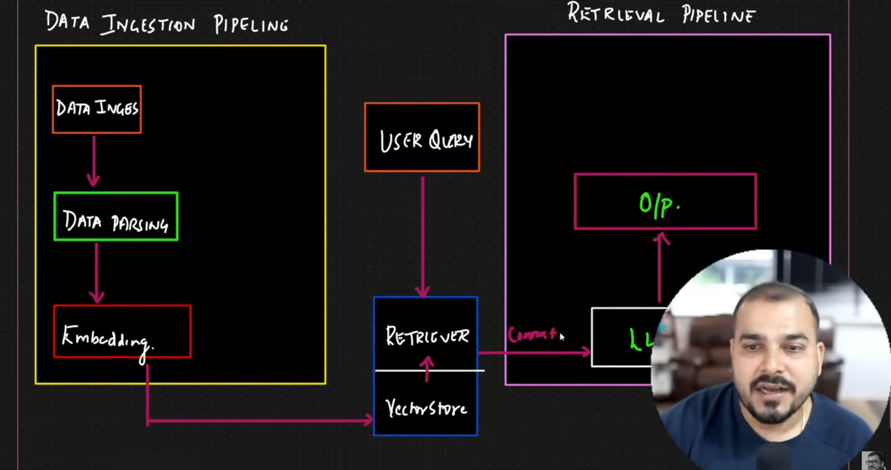

RAG: Retrival Augumented Generation is process of optimizing the output of a large language model so it "references" a knowledge base outside of its training data before generatig a response.LLm's usually have a large training base and used for various methods . Rag extends these capabilites of llms to specific domains or an organisations internal knowldge base , without retrainig the model , its a cost effective method.

- Helps us prvent Hallusination
- NO need for expensive re-training
-

<---------------Data Ingestion Pipeline--------------------> (Knowledge base)
Pdf -> Parsing(chunking)->Vector embeddings(Text to Vector)-> Vector DB

### Traditional RAG

<--REtrival PIpeline ----------------------------------------------------------------------------------------->
USer Query --> Turn into Embediggings -> DO cosine search on custom Knowledge base -> pass the fetched context and prompt to LLm ( i.e Context: 21 day leave policy , Prompt: "you may use the knowledge base to answer" )-> LLm->Output

### Agenda

- Document Structure

- Complete RAG Pipeline
  - Data Ingestion Pipeline
  - Data Retrival Pipeline

`Note : Data Pharsing is one of the important steps , that can make Retrival Efficient when done right`

### Data Ingestion

## Code :

Steps:

- `uv init`
- `uv venv --python 3.13` create venv
- activate venv `.venv\Scripts\activate`
- add packages `uv add -r requirements.txt`
- `uv add ipykernal`

- create document to store data efficiently (data pharsing)

Once the install completes, run it with:

bash
uv run streamlit run streamlit_app.py
Or if you're in the venv:

bash
streamlit run streamlit_app.py