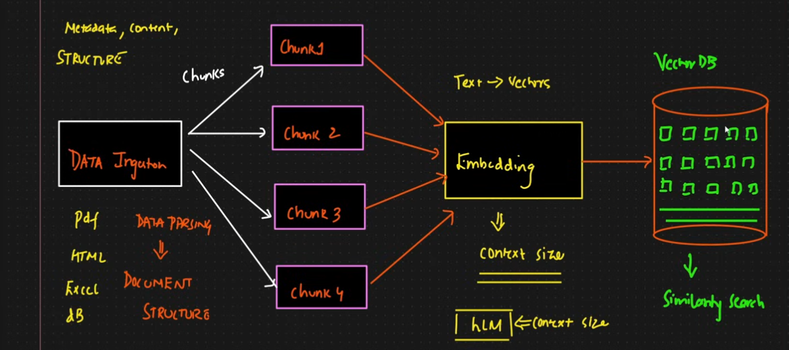

# 🔍 RAG — Retrieval-Augmented Generation Pipeline


A hands-on Python project that explores and implements a **full Retrieval-Augmented Generation (RAG) pipeline** using LangChain, FAISS, Sentence Transformers, and Groq LLMs — all built and experimented in Jupyter Notebooks.

---

## 🧠 What is RAG?

**Retrieval-Augmented Generation (RAG)** is a technique that optimizes LLM output by grounding responses in an external knowledge base — without retraining the model. It allows you to:

- ✅ Prevent hallucinations
- ✅ Query your own documents / domain-specific knowledge
- ✅ Avoid expensive model fine-tuning


## Check It Out

[Launch Edison RAG Bot ](https://edison-rag-bot.streamlit.app/)
---

## 📐 Architecture

### Data Ingestion Pipeline (Knowledge Base)

```
PDF / TXT Files → Parsing & Chunking → Vector Embeddings → Vector DB (FAISS / ChromaDB)
```

### Retrieval Pipeline

```
User Query → Embed Query → Cosine Similarity Search (Vector DB) → Fetch Context → LLM → Answer
```



---

## 📓 Notebooks

### 1. [`document.ipynb`](./notebook/document.ipynb) — Document Structure & Loaders

Covers the fundamentals of the LangChain **Document** object and different document loaders:

- Creating `Document` objects with `page_content` and `metadata`
- `TextLoader` — load individual `.txt` files
- `DirectoryLoader` — batch-load entire directories of `.txt` or `.pdf` files
- `PyMuPDFLoader` — efficient PDF loading with rich metadata (author, creation date, page count, etc.)
- Loading multi-page PDFs and accessing per-page content

**Example metadata extracted:**
```python
{
  'source': 'data/pdf/dog-care-guide.pdf',
  'total_pages': 13,
  'page': 0,
  'author': '',
  'creationdate': '2017-01-30T15:18:48-08:00'
}
```

---

### 2. [`pdf_loader.ipynb`](./notebook/pdf_loader.ipynb) — Full RAG Pipeline

The main notebook implementing the complete end-to-end RAG pipeline:

#### Step 1 — PDF Loading
- Batch-processes all PDFs in a directory using `PyPDFLoader`
- Enriches each document with custom metadata (`source_file`, `file_type`)

#### Step 2 — Chunking
- Uses `RecursiveCharacterTextSplitter` with:
  - `chunk_size = 1000`
  - `chunk_overlap = 200`
- Splits 21 raw documents into **84 overlapping chunks**

#### Step 3 — Embedding
- Wraps `sentence-transformers` (`all-MiniLM-L6-v2` or similar) in a custom `EmbeddingManager` class
- Generates dense vector embeddings (shape `[n, 384]`) in batches

#### Step 4 — Vector Store (FAISS)
- Stores embeddings in a **FAISS** in-memory vector store
- Custom `VectorStore` class manages `add_documents` and `search` operations
- Each document stored with full metadata for traceability

#### Step 5 — Retrieval
- `RAGRetriever` class queries the vector store using cosine similarity
- Configurable `top_k` and `score_threshold` parameters
- Returns ranked documents with similarity scores and distances

```python
rag_retriever.retrieve("Who is Harry Potter")
# → Returns top-k chunks from pl_stone.pdf, hb_prince.pdf, etc.

rag_retriever.retrieve("What diseases can my dog have")  
# → Returns top-k chunks from dog_diseases.pdf
```

#### Step 6 — LLM Generation with Groq
- `GroqLLM` class wraps `langchain-groq` with `ChatGroq`
- Default model: **`gemma2-9b-it`** (configurable to `llama3-70b-8192`, `qwen2-72b-instruct`, etc.)
- Uses a `PromptTemplate` to combine retrieved context + user question
- API key loaded from `.env` via `python-dotenv`

---

## 🗂️ Project Structure

```
RAG/
├── .streamlit/
│   └── config.toml                 # Streamlit UI configuration
├── notebook/
│   ├── document.ipynb              # Document loaders & LangChain Document structure
│   ├── pdf_loader.ipynb            # Full RAG pipeline (ingestion → retrieval → generation)
│   └── data/                       # Sample data used inside notebooks
│       └── text_files/             # Sample .txt files (Harry Potter summaries, etc.)
├── data/                           # Place your PDFs here for ingestion
│   └── pdf/                        # PDF files used in the pipeline
├── images/
│   ├── Rag.png                     # RAG architecture diagram
│   ├── Data-Ingestion.png          # Data ingestion pipeline diagram
│   └── hero.png                    # Hero banner image
├── edison.png                      # Edison mascot image
├── rag_pipeline.py                 # Core RAG pipeline logic
├── streamlit_app.py                # Edison RAG Bot Streamlit UI
├── main.py                         # Entry point (placeholder)
├── requirements.txt                # Pip-compatible dependency list
├── pyproject.toml                  # uv project config
├── .env                            # API keys (not committed to git)
├── .gitignore
└── README.md
```

---

## 🛠️ Tech Stack

| Tool | Purpose |
|---|---|
| [LangChain](https://python.langchain.com/) | Document loaders, text splitters, prompt templates |
| [FAISS](https://github.com/facebookresearch/faiss) | Fast vector similarity search |
| [ChromaDB](https://www.trychroma.com/) | Alternative vector store |
| [Sentence Transformers](https://www.sbert.net/) | Local embedding generation |
| [PyMuPDF (`pymupdf`)](https://pymupdf.readthedocs.io/) | Efficient PDF parsing |
| [PyPDF](https://pypdf.readthedocs.io/) | PDF loading |
| [Groq](https://groq.com/) | Fast LLM inference (`gemma2`, `llama3`, etc.) |
| [python-dotenv](https://github.com/theskumar/python-dotenv) | Environment variable management |
| [uv](https://github.com/astral-sh/uv) | Fast Python package manager |

---

## 🚀 Setup & Installation

This project uses [`uv`](https://github.com/astral-sh/uv) for fast dependency management. You can also use standard `pip`.

### Using `uv` (recommended)

```bash
# 1. Clone the repo
git clone <your-repo-url>
cd RAG

# 2. Create virtual environment with Python 3.13
uv venv --python 3.13

# 3. Activate the virtual environment
.venv\Scripts\activate           # Windows
# source .venv/bin/activate      # Linux / macOS

# 4. Install dependencies
uv add -r requirements.txt

# 5. Install Jupyter kernel
uv add ipykernel
```

### Using `pip`

```bash
python -m venv .venv
.venv\Scripts\activate
pip install -r requirements.txt
pip install ipykernel
```

### 🖥️ Running the Streamlit App

Once the installation is complete and your environment is set up:

**Using `uv`:**
```bash
uv run streamlit run streamlit_app.py
```

**Using standard `venv`:**
```bash
streamlit run streamlit_app.py
```

---

## ⚙️ Configuration

Create a `.env` file in the project root:

```env
GROQ_API_KEY=your_groq_api_key_here
```

Get your free Groq API key at [console.groq.com](https://console.groq.com).

---

## 📄 Sample Data

The notebooks were tested with a mix of documents:

| File | Type | Description |
|---|---|---|
| `pl_stone.pdf` | PDF | Harry Potter and the Philosopher's Stone summary |
| `hb_prince.pdf` | PDF | Harry Potter and the Half-Blood Prince summary |
| `dog-care-guide.pdf` | PDF | A dog care guide (13 pages) |
| `dog_diseases.pdf` | PDF | Veterinary research paper on canine diseases |
| `web react.pdf` | PDF | React lab exercises document |
| `goblet_summary.txt` | TXT | Harry Potter and the Goblet of Fire summary |
| `azkaban.txt` | TXT | Harry Potter and the Prisoner of Azkaban summary |

---

## 📖 Key Concepts Implemented

- **LangChain Document** — standard object with `page_content` + `metadata`
- **Document Loaders** — `TextLoader`, `DirectoryLoader`, `PyPDFLoader`, `PyMuPDFLoader`
- **Chunking** — `RecursiveCharacterTextSplitter` with configurable size & overlap
- **Embeddings** — `sentence-transformers` for local, offline embedding generation
- **Vector Search** — FAISS cosine similarity with ranked, scored results
- **RAG Prompt** — Context-injected prompt template sent to Groq LLM
- **End-to-End Pipeline** — From raw PDFs to natural language answers

---

## 📝 Notes

- The `data/` directory is empty in the repo — add your own PDFs before running the pipeline notebook.
- The `.env` file with your `GROQ_API_KEY` is excluded from git via `.gitignore`.
- Embedding generation runs locally via `sentence-transformers` — no external API needed for the retrieval step.

---

## 📜 License

This project is for educational and personal learning purposes.
